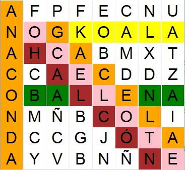
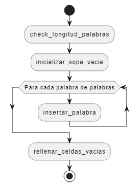

# Juego "Sopa de Letras"

## Contexto
Se ha diseñado un juego de Sopa de Letras, y ya se dispone de la implementación de su interfaz gráfica. Sin embargo, aún faltan por implementar las funciones encargadas de la generación aleatoria de las sopas de letras, a partir de un conjunto de palabras a buscar. Estas funciones están especificadas en el módulo ``src/sopadeletras/utiles.py``

La función principal a implementar es la siguiente:

```python
def generar_sopa(
    palabras: List[str], filas: int, columnas: int
) -> List[List[str]]:
```

Esta función recibe una lista de palabras a buscar, y el número de filas y columnas de la sopa de letras, y devuelve una lista de listas de caracteres con la sopa generada. Las palabras a buscar pueden aparecer en la sopa de letras en tres direcciones: vertical (de arriba a abajo), horizontal (de izquierda a derecha) o diagonal (de arriba a abajo y de izquierda a derecha).

Por supuesto, existen muchas posibles maneras de generar una sopa de letras para unas palabras dadas. Por ejemplo, si las palabras a buscar son OCELOTE, ANACONDA, BALLENA, GACELA, HALCÓN y KOALA, la llamada a la función y una posible salida serían:

```python
>>> generar_sopa(['OCELOTE', 'ANACONDA', 'BALLENA', 'GACELA', 'HALCÓN', 'KOALA'], 8, 8)
[['A', 'F', 'P', 'F', 'E', 'C', 'N', 'U'],
 ['N', 'O', 'G', 'K', 'O', 'A', 'L', 'A'],
 ['A', 'H', 'C', 'A', 'B', 'M', 'X', 'T'],
 ['C', 'C', 'A', 'E', 'C', 'D', 'D', 'Z'],
 ['O', 'B', 'A', 'L', 'L', 'E', 'N', 'A'],
 ['N', 'M', 'Ñ', 'B', 'C', 'O', 'L', 'I'],
 ['D', 'C', 'C', 'G', 'J', 'Ó', 'T', 'A'],
 ['A', 'Y', 'V', 'B', 'N', 'Ñ', 'N', 'E']] 
```

cuyo resultado devuelto se correspondería con la siguiente sopa de letras (se han coloreado las palabras para que sea más sencillo identificarlas):



Fíjese que **las palabras a buscar pueden compartir algunas letras**, y que el resto de posiciones del tablero se rellenan con letras aleatorias. 

Como llevar a cabo esta funcionalidad es complejo, se propone el siguiente diseño de la implementación de la función ``generar_sopa``, en la que el problema se ha descompuesto en otros problemas más pequeños:



A su vez, se propone el siguiente diseño para la implementación de la función ``insertar_palabra``, en el que volvemos a descomponer el problema en otros más pequeños:


## Objetivo

**Implemente** las funciones especificadas en el módulo ``src/sopadeletras/utiles.py``. Todas ellas van encaminadas al objetivo final de generar una sopa de letras aleatoria de un tamaño específico para unas palabras determinadas. El orden en que aparecen las funciones en el módulo es en el que deben resolverse, puesto que algunas funciones posteriores se apoyan en funciones anteriores. 

Para cada función, se proporciona un comentario de documentación que indica claramente qué debe realizar la función, qué parámetros recibe, qué devuelve y, en su caso, si debe lanzar algún error bajo alguna circunstancia. También se incluyen ejemplos de casos de prueba, que puede utilizar para probar la función de manera interactiva. Para hacer esto, abra un terminal, ejecute el entorno python mediante los comandos ``python`` o ``ipython``, e importe las funciones del módulo mediante la sentencia ``from src.sopadeletras.utiles import *``. A continuación, ejecute la secuencia de instrucciones indicadas en los tests, y observe si obtiene las salidas esperadas. Tenga en cuenta que algunas funciones tienen un carácter aleatorio, por lo que los resultados obtenidos pueden no ser exactamente los indicados en los casos de prueba.

Una vez considere que una función está correctamente implementada, ejecute el módulo ``src/sopadeletras/utiles_test.py``, el cual probará exhaustivamente las implementaciones y le informará de si todas las pruebas son superadas con éxito. Si no supera alguno de los tests, **depure** su implementación con ayuda del depurador de Visual Studio Code. 

Una vez todas las funciones estén correctamente implementadas, debería poder ejecutar el juego mediante el módulo ``sopadeletras/gui.py``, y el juego debería ser completamente funcional. Use el ratón para seleccionar las palabras que vaya encontrando, pulsando en la primera letra y arrastrando el puntero hasta la última letra sin soltar el botón del ratón.
